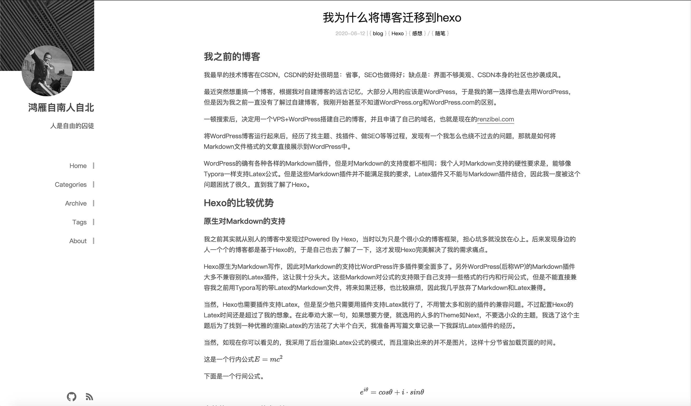

# Icalm




[Live example](https://renzibei.com)

## Browser Support

Latest versions of modern browsers for ES2015+ support.

Basic style support for outdated browsers.

Use [InstantClick](instantclick.io) for fast loading.

## Installation

```
git clone https://github.com/renzibei/hexo-theme-icalm.git themes/hexo-theme-icalm
cd themes/hexo-theme-icalm/
git submodule update --init --recursive
```

update

```
git pull && git submodule update --remote
```

## Customize

Edit `_config.yml`.

You can add support for

- social media like github, facebook
- RSS
- Latex with pandoc and [hexo-filter-mathjax](https://github.com/next-theme/hexo-filter-mathjax)

## Tags or Categories Page

Run `hexo n page "tags"` or `hexo n page "categories"`

Then edit the generated .md file, set the `type` to `tags` or `categories`.

## Speed up loading static assets with jsDelivr CDN

Now you can use `hexo-cdn-jsdelivr` to speed up the loading of static assets like images. You can check it in its [Github repo](https://github.com/renzibei/hexo-cdn-jsdelivr).

You may have to install it to avoid some of the errors in template files.

## TODO List

- [ ] Remove unnecessary katex css loading

- [x] Make static assets CDN more automatic

## Add License

To add license information to website footer, just add a `license` entry to hexo's `_config.yml`.

## LICENSE

MIT
